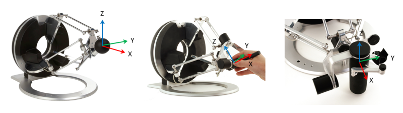
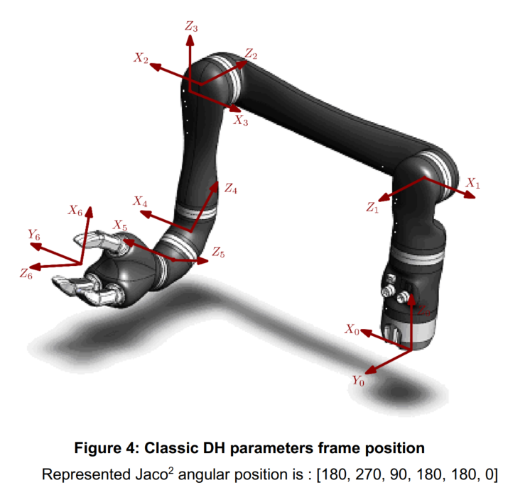

# teleop-cli

A simple CLI testbed for tele-operating the [Kinova](http://www.kinovarobotics.com/) [JACO² arm](http://www.kinovarobotics.com/innovation-robotics/products/robot-arms/#jaco0), using a [Force Dimension](http://forcedimension.com/) haptic device as a master.

## Requirements

We use the Force Dimension [Omega.7](http://www.forcedimension.com/products/omega-7/overview) haptic device, and the Kinova [JACO² 6DOF Non-Spherical](http://www.kinovarobotics.com/innovation-robotics/products/robot-arms/#jaco1) arm (part # j2n6s300).

Breakdown of the Kinova naming convention;

 * Category: j for jaco
 * Version: 2
 * Wrist type: n for non-spherical, s for spherical
 * Degree of freedom: 6
 * Mode: s for service
 * Hand: 3 for the 3-finger gripper
 * Last two digits are undefined and reserved for further features

 Currently only supports Windows (tested on Windows 10 64 bit).

## Set-up instructions

 1. Download and install the [Kinova SDK JACO²](http://www.kinovarobotics.com/innovation-robotics/support/?section=resources). At the time of writing, release 1.4.0 was the latest.
 2. Add the JACO² SDK 'API' folder to your environment variables as `JACO2SDKROOT`. E.g. `setx JACO2SDKROOT "C:\Program Files (x86)\JACO2SDK\API"`
 3. Download and extract the latest [CHAI3D release](http://www.chai3d.org/download/releases) (or clone the [CHAI3D Git repo](https://github.com/chai3d/chai3d)). At the time of writing, release 3.2 was the latest.
 4. Add the CHAI3D SDK folder to your environment variables as `CHAI3DSDKROOT`. E.g.  `setx CHAI3DSDKROOT "E:\Development\SDKs\chai3d"`
 5. Open the Visual Studio `sln` file and try building!

## Coordinate Frames

The coordinate frames for the Force Dimension devices and Kinova JACO² arm we use are shown below. As can be seen, the haptic master pose needs to be rotated around the Z axis 180° to match the JACO² frame (the JACO² Cartesian Control API is relative to the base frame). This occurs in [`teleop-cli.cpp:282`](../db9688271dd5f004d6f7f74b7ec3466e6b8d0219/teleop-cli.cpp#L282).

